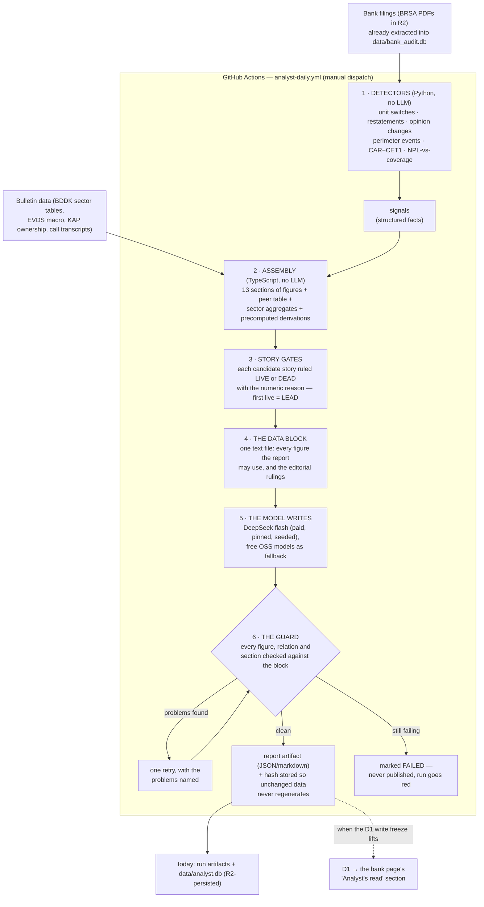
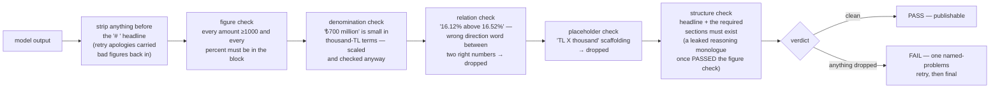

# The Analyst — how a bank filing becomes a research report

This is the plain-language tour of the analyst lane: what runs, in what order,
and why the reports can be trusted. The task-level build record with pass/fail
criteria lives in `docs/knowledge/2026-08-04-analyst-build-plan.md`
(internal — the knowledge base is gitignored); this page is the map.

**The one-sentence version:** deterministic code digs every number and every
judgment out of the stored filings, a cheap LLM writes the connecting prose,
and a guard throws away any sentence it cannot prove — so the report reads
like an analyst wrote it, but every figure is machine-checked against the
bank's own filings.

## The big picture



## Step by step, in plain words

**1 · Detectors look for what changed.** Python code (no model anywhere)
compares every bank's new numbers against its own history and its own earlier
filings: did the reporting unit silently switch a thousand-fold, did the bank
restate last year's figures, did the auditor's opinion change, did a business
get bought or sold, is a headline ratio concealing its composition (a fat CAR
hiding thin core capital; a falling NPL ratio hiding collapsing coverage)?
Each finding becomes a small structured **signal** with the numbers attached.

**2 · Assembly gathers everything an analyst would look at.** For the chosen
bank and quarter, TypeScript code runs ~20 SQL queries and lays out thirteen
sections: earnings, asset quality, capital, funding, FX, ownership, the macro
backdrop, BDDK's own sector totals, and a named peer table (the ten biggest
banks in the same licence class, each with its own filed figures). The tricky
derivations are **precomputed here** — the mix-vs-erosion split of a coverage
fall, capital-vs-RWA growth, ex-release profit, growth percentages, totals —
because a model asked to do arithmetic will eventually do it wrong.

**3 · Story gates decide what the report is about.** Six candidate stories
(data-integrity events, free-provision distortion, capital composition,
coverage divergence, peer deviation, negative real returns) are each ruled
**LIVE or DEAD** for this specific bank, with the numeric reason, in a fixed
editorial order. The first live story is the **LEAD** — the headline must
state it, every live story must get its own paragraph, and a dead story may
appear only as one "notably absent" sentence. This is what stops the model
from telling Bank A's story about Bank B.

**4 · Everything becomes one data block.** A single text file: every figure,
every table, the gates, the bank's own stage-definition disclosures, verbatim
quotes from its latest earnings call, and an explicit list of what we do NOT
hold (so the report says "not held" instead of guessing). This block is the
model's entire world — and, crucially, it is also the guard's answer key.

**5 · The model writes.** DeepSeek flash (cheap, pinned to one upstream,
seeded for reproducibility) writes a ~2,500–4,000-word report in a fixed
13-section skeleton. It is told, in effect: *every number you write must
appear in the block; the derived numbers you need are already there; if it
isn't held, say so.*

**6 · The guard proves it — or throws it away.** See below. A paragraph that
fails is dropped whole; the model gets exactly one retry with the problems
named; a report that still fails is marked FAILED and never publishes.

**7 · Nothing regenerates for no reason.** Each report stores a fingerprint
of the bank-side data it was built from. Next run, same fingerprint → the
report is skipped, not re-rolled. (Daily macro noise like the FX rate is
excluded from the fingerprint on purpose.)

## The guard, tooth by tooth

Every tooth exists because a real run got past the previous set:



What the guard **cannot** check, stated honestly: semantics. A wrong *word*
about a right *number* ("only 0.47%" for a 47% share) passes. That class is
shrunk by precomputing the judgment (comparisons, gates) rather than caught
at the gate.

## Running it

From `/admin` → Pipeline panel → **Analyst memos**, or:

```
gh workflow run analyst-daily.yml -f banks=GARAN -f period=2026Q1 -f kind=consolidated
```

- `banks` — comma-separated tickers; `CALIBRATE` = the ALBRK+ŞEKERBANK pair
  the hand-written feasibility memos cover; `NONE` = detectors only.
- `kind` — `consolidated` matches how banks present themselves (and where
  group events like disposals appear); `unconsolidated` is the solo bank.
- `force_regen` — regenerate even when the data fingerprint is unchanged.

Reports come back as **run artifacts** (`analyst_memo_<BANK>_<PERIOD>_<KIND>.json`
— the markdown body plus the guard verdict, the gates, and the dropped-paragraph
detail). A scoreboard step prints structure/lead/coverage per report.

## What is on and what is waiting

| Piece | State |
|---|---|
| Detectors, assembly, gates, guard, reports | **Live** — dispatch any bank |
| Report artifacts + R2-persisted staging (`data/analyst.db`) | **Live** |
| Comparability badge on `/banks/[ticker]` | **Live** (built from already-pushed tables) |
| Memos on the bank page, `analyst_signals`/`analyst_notes` in D1 | **Waiting on the D1 write freeze** — migration `0037` is authored, unapplied; the page shows "Analysis pending" and lights up on its own once pushed |
| Daily schedule | **Deliberately absent** until the freeze lifts (dispatch-only) |
| 2026Q2 filings | Held in R2, unextracted — the unit-switch detectors built here are what makes re-extracting them safe |

## Where the pieces live

| Path | What it is |
|---|---|
| `src/analyst/` | The detectors (Python, stdlib-only) + staging schema |
| `scripts/analyst/detect.py` | Runs all detectors → signals + basis metadata (`--stage` → `data/analyst.db`) |
| `scripts/analyst/extract_stage_definitions.py` | Reads the local prose corpus → each bank's own disclosed staging thresholds |
| `scripts/analyst/score_reports.py` | The report scoreboard |
| `web/app/lib/analyst/` | Assembly (`sections`, `series`, `peers`, `comparator`), the prompt + story gates, the guard, the runner |
| `web/app/lib/analyst/stage-definitions.ts` | **Generated** — 24/38 banks' disclosed thresholds, verbatim snippets |
| `web/scripts/analyst-run.ts` | The CI/local entry point (`--sections` / `--prompt` / `--memo`) |
| `web/app/banks/[ticker]/AnalystSection.tsx` | The bank-page badge + memo slot |
| `.github/workflows/analyst-daily.yml` | The workflow everything above runs in |
| `web/migrations/0037_analyst_signals.sql` | The D1 tables, authored and waiting |
