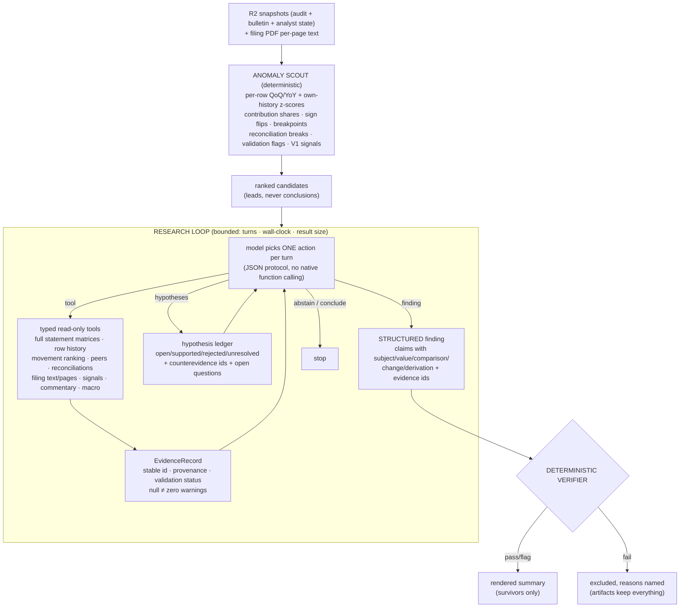

# Analyst V2 — agentic discovery over deterministic evidence

V2 replaces V1's predetermined analytical brain (fixed sections, binding story
gates, one-shot memo) with an investigation: a deterministic scout surfaces
what moved, a bounded research loop lets the model decide what to examine
next through typed read-only tools, findings come back as structured
machine-checkable claims, and a deterministic verifier — not the model —
decides what survives. V1 stays intact as the regression baseline and as an
evidence-pack generator.

**Governing principle:** deterministic evidence and verification; agentic
discovery and investigation.

**Status: evaluation phase.** Artifact-only, no D1 writes, no schedule, no
automatic publishing. Publishing integration requires the evaluation corpus
to pass and explicit human approval.

## Architecture



## The tool contract

Twelve tools (`web/app/lib/analyst/v2/tools.ts`), all read-only, all
parameter-bound, all allowlisted through the statement registry
(`registry.ts` — every table, column, row identity and reading caveat; the
corpus rules live with the data, not in prompt prose):

`list_available_data · get_validation_status · get_statement_rows ·
get_row_history · rank_statement_movements · compare_with_peers ·
reconcile_statements · search_filing_text · get_source_page ·
get_existing_signals · get_management_commentary ·
get_regulatory_or_macro_context`

Every result is an **EvidenceRecord**: deterministic id (fnv1a over tool +
canonical args + snapshot id), snapshot/tables/bank/period/kind/source-pages
provenance, the partition's validation warnings, and missing-data warnings
(NULL is warned about, never zeroed). Identical calls dedupe to the same id.

The registry deliberately exposes what V1 curated away — most importantly the
complete `equity_change` matrix (all fourteen component columns per movement
row), plus OCI and cash flow whole.

## The findings model

Everything verifiable is a **Claim**:

```
{ claim_id, claim_kind: value|comparison|change|reconciliation,
  subject: { bank, period, kind, statement?, row?, metric? },
  value?, unit?,
  comparison?: { op, rhs_value },
  change?: { from_period, from_value, to_value, delta },
  derivation?: { formula, inputs[] },
  evidence_ids[] }
```

A **Finding** carries claims plus: classification (`observed_fact` /
`interpretation` / `scenario`), thesis (numbers there must trace to claims or
cited evidence), materiality rationale, confidence, counterevidence
considered, caveats, missing data, source pages. Claimless findings are
rejected at emission time — unverifiable prose never enters the pipeline.

## The verifier

Deterministic, per finding (`verifier.ts`):

| Check | Catches |
|---|---|
| evidence resolution | citing ids that don't exist |
| entity/kind association | a number that belongs to another bank/basis |
| period association (single-period tools) | a 2026Q1 value asserted on a 2025Q1 row |
| value-in-evidence | any number not present in the cited evidence |
| comparison direction | "3.22% is higher than 3.49%" |
| comparison rhs-in-evidence | a fabricated comparator |
| change arithmetic | from + delta ≠ to |
| derivation inputs | computed figures with unevidenced inputs |
| thesis number tracing | prose numbers with no claim behind them |
| causal-language policy | "because/driven by" without a reconciliation or derivation claim (fails an observed_fact) |
| forecast policy | forward-looking language outside a labelled scenario; scenarios need disclosed assumptions |
| failed-partition caveat | using a validation-failing partition without saying so |
| cross-finding contradiction | two findings asserting opposite directions on the same subject |

All thirteen are pinned by regression tests, including the five error classes
the V1 guard provably passed. Verdicts: pass / flag / fail; the renderer
prints survivors only; the UI's strongest permitted wording is **"automated
checks passed"** — the verifier proves structure and association, not truth.

## The loop

JSON action protocol — one object per turn: `tool` / `hypotheses` /
`finding` / `abstain` / `conclude`. Lenient balanced-brace extraction (no
provider function-calling assumed); a protocol violation gets one repair
message and costs the turn; three consecutive violations abort into
abstention. Budgets: 22 turns, 9 minutes wall-clock, 6KB per tool result
(truncation says so), ≤3 findings. The hypothesis ledger (id, statement,
status, materiality, confidence, supporting/counter evidence ids, open
questions) is the model's to maintain and is persisted whole. **Abstention
is a first-class success** — "ordinary quarter, here is what was checked."

Model chain: `deepseek-v4-flash` (paid, pinned, seeded) → the free OSS chain;
nemotron excluded (measured reasoning-leak).

## Artifacts (per run of `analyst-research.yml`)

```
scout_<B>_<P>_<K>.json            ranked candidates + suppressed count
evidence_<B>_<P>_<K>.jsonl        every evidence record, full provenance
research_trace_<B>_<P>_<K>.jsonl  every turn: action, result id, errors
hypotheses_<B>_<P>_<K>.json       the final ledger
findings_<B>_<P>_<K>.json         structured findings as emitted
verification_<B>_<P>_<K>.json     per-finding checks and verdicts
analyst_summary_<B>_<P>_<K>.md    rendered survivors (+ named failures)
run_metrics_<B>_<P>_<K>.json      turns, tool calls, protocol errors, duration, model
```

## Evaluation

The corpus lives in `data/analyst_eval/cases.json` — real cases with expected
findings, acceptable alternatives, forbidden claims, required evidence kinds
and known limitations; `scripts/analyst/eval_research.py` scores a run's
artifacts against a case. Metrics: unsupported-claim rate,
entity/period/kind mismatch rate, evidence resolution rate, material-story
precision/recall, correct-abstention rate, contradiction rate, cost/runtime,
stability across repeats.

Minimum bar before any publishing integration: zero unsupported numerical
claims, zero association mismatches, every factual claim resolving to
evidence, no unlabelled forecasts, no failed-partition use without a warning
— and human approval per finding until the corpus demonstrates dependable
performance.

## Operating procedure

```
gh workflow run analyst-research.yml -f banks=ALBRK -f period=2025Q1 -f kind=unconsolidated
gh workflow run analyst-research.yml -f banks=TEB -f period=2025Q2 -f scout_only=true
```

Locally, `npx tsx web/scripts/analyst-research.ts --bank X --period Y --scout`
runs everything except the LLM loop and the filing-text tools (R2 creds and
LLM keys are CI secrets).

## Known limitations

- The verifier proves **structure, association and arithmetic** — not
  semantics. A wrong word about a right number inside the thesis can pass;
  the claim schema shrinks that surface, it does not eliminate it.
- The loop's discovery ceiling is the model's. On the current chain, the
  realistic behavior is *investigation of scout-surfaced anomalies*, which is
  exactly what the design leans on; open-ended discovery beyond the scout is
  the stretch goal the evaluation corpus adjudicates.
- Equity-matrix boundary detection (opening/closing rows) is heuristic where
  filers template-shift labels; the reconciliation tool reports its method
  and the researcher is instructed to trust arithmetic over labels.
- `search_filing_text`/`get_source_page` need the per-run PDF pre-extract;
  absent it they degrade to a stated warning, never a silent gap.
- Peer stage comparisons still carry the stage-definition caveat except where
  both banks' disclosed thresholds are held (24/38 banks).
