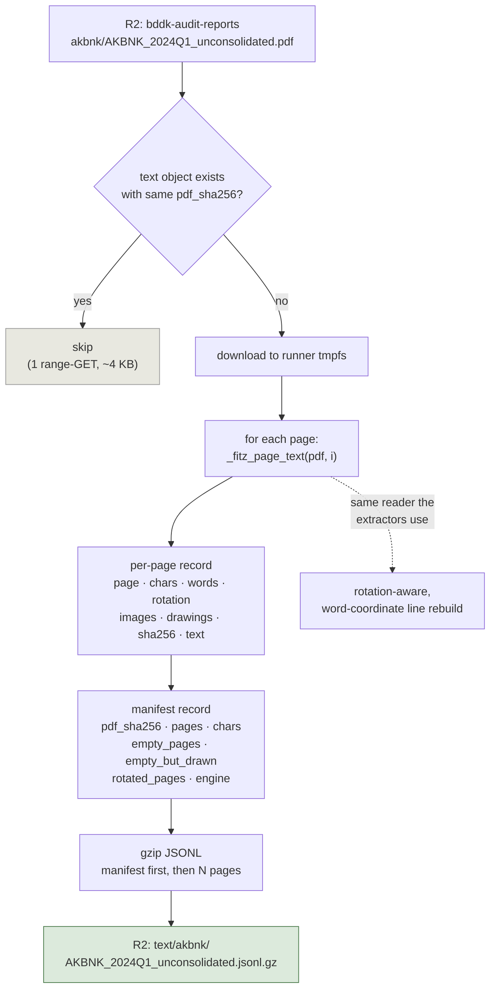

# Audit-report text lane (tier 1) — workflow, proven on one filing

**Date:** 2026-08-03
**Status:** PROTOTYPE — script written and run locally on a single PDF. Nothing
uploaded to R2, no workflow file created, no D1 write. Not committed.
**Code:** `scripts/extract_audit_text.py`
**Test input:** `data/eye/AKBNK_2024Q1_unconsolidated.pdf` (88 pages, 645 KB)

## Why the lane exists

Every statement extractor opens the PDF, takes the pages it needs and discards
the rest. A large share of a filing is prose — accounting policies, the Pillar-3
narrative, ratings, subsequent events — that no lane has ever read, and the
question *"which banks mention X"* is currently unanswerable because the text
does not exist anywhere outside the PDFs in R2. (An earlier draft put that share
at "about 40%". It is not a defensible number — see *Prose is not differentiated*
below.)

Tier 1 materialises the text once. No model, no interpretation, no D1 write. It
is a transcription step, and it is the prerequisite for every later prose idea.

## The workflow



## The test run

```
$ python scripts/extract_audit_text.py \
    --pdf data/eye/AKBNK_2024Q1_unconsolidated.pdf --out-dir build/audit_text

AKBNK_2024Q1_unconsolidated.pdf
  pages         88
  chars         301,579
  empty pages   0 (0 vector-drawn)
  rotated pages 2
  written       build/audit_text/AKBNK_2024Q1_unconsolidated.jsonl.gz
                (88,508 B gz, 0.29 B/char)
  would upload  text/akbnk/AKBNK_2024Q1_unconsolidated.jsonl.gz
```

Wall clock: **1.0 s for 88 pages** (11 ms/page), of which serialisation is 0.02 s.

### Manifest record

```json
{
  "record": "manifest",
  "pdf_sha256": "a87399b215ab0a45e831aebf0b0b9f1521162d5fad99eb3b91aa7562c1887afc",
  "pdf_bytes": 644703,
  "pages": 88,
  "chars": 301579,
  "empty_pages": [],
  "empty_but_drawn": [],
  "rotated_pages": [12, 13],
  "engine": "pymupdf-1.27.2.3",
  "extracted_at": "2026-08-03T12:54:15+00:00"
}
```

### Page records

| page | chars | words | rotation | images | drawings |
|---|---|---|---|---|---|
| 1 | 176 | 23 | 0 | 0 | 0 |
| 2 | 3,939 | 499 | 0 | 0 | 0 |
| 3 | 1,933 | 270 | 0 | 0 | 8 |
| 41 | 4,215 | 511 | 0 | 0 | 41 |
| 58 | 3,364 | 468 | 0 | 0 | 27 |

Page 58, first 300 chars — the §5 notes opening, prose and heading intact:

```
AKBANK T.A.Ş.
31 MART 2024 TARİHİ İTİBARIYLA KONSOLİDE OLMAYAN
FİNANSAL TABLOLARA İLİŞKİN AÇIKLAMA VE DİPNOTLAR
(Tutarlar aksi belirtilmedikçe bin Türk Lirası ("TL") olarak ifade edilmiştir.)
BEŞİNCİ BÖLÜM
KONSOLİDE OLMAYAN FİNANSAL TABLOLARA İLİŞKİN AÇIKLAMA VE DİPNOTLAR
I. AKTİF KALEMLERE İLİŞKİN AÇIKLAMA VE DİPNOTLAR
```

## Three design choices, each with a cheaper wrong version

**Page-anchored JSONL, not one flat `.txt`.** Every consumer in this repo works
in page coordinates — `source_page` columns, `triage.py`'s page render, the
extractors' page scan. A flat blob cannot be rejoined to any of it.

**It calls `_fitz_page_text`, the extractors' own reader** — not `page.get_text()`.
The shortcut would have silently diverged: the shared reader rebuilds lines from
word-box coordinates and maps `/Rotate 90` pages through the rotation matrix
first. The cost of that fidelity is visible in the numbers — the shared reader
returns **301,579 chars where raw `get_text()` returns 367,313** (−18%), because
it collapses layout whitespace instead of emitting it. Dumping the raw-reader
text would mean the corpus disagreed with what every extractor actually saw, and
the disagreement would surface later as a phantom data bug.

**The manifest carries text-layer health, not just sizes.** An empty
`get_text()` is ambiguous — undisclosed, or a page drawn as vectors. Recording
per-page image and drawing counts makes `empty_but_drawn` a decidable flag, and
tier 1 produces it fleet-wide for free. This filing has none; page 41 carries 41
drawings *with* full text, which is what a normally-ruled table looks like.

## Trap found on the first filing

Sectioning (tier 2) looked like a one-liner — the seven `BÖLÜM` headings are a
mandated fixed surface, so regex should locate them. It does, **and the first
match for all seven is page 4**, because page 4 is the table of contents. Each
heading appears exactly twice:

| section | title (this filing's own contents page) | TOC | real start | span | chars |
|---|---|---|---|---|---|
| BİRİNCİ | Banka hakkında genel bilgiler | 4 | 5 | 5–6 | 4,538 |
| İKİNCİ | Konsolide olmayan finansal tablolar | 4 | 7 | 7–14 | 31,167 |
| ÜÇÜNCÜ | Uygulanan muhasebe politikaları | 4 | 15 | 15–28 | 65,847 |
| DÖRDÜNCÜ | Mali bünye ve risk yönetimi | 4 | 29 | 29–57 | 113,527 |
| BEŞİNCİ | Finansal tablolara ilişkin dipnotlar | 4 | 58 | 58–83 | 60,869 |
| ALTINCI | **Sınırlı denetim raporuna ilişkin açıklamalar** | 4 | 84 | 84 | 2,613 |
| YEDİNCİ | **Ara dönem faaliyet raporu** | 4 | 85 | 85–88 | 12,707 |

A naive first-match sectioner assigns all 7 sections to page 4 and produces
seven empty bodies without failing. Take the last occurrence, or require a body
after the heading. The resulting map also confirms the size claim: §3 accounting
policies is 14 pages, §4 is 29, §5 notes is 26 — 69 of 88 pages are sections no
lane reads today.

## Correction to the section map

The bolded rows above contradict what `reference_audit_report_full_structure`
records (§6 "other explanations", §7 "auditor's report"). Both are right — **§6
and §7 are period-dependent**, and each filing declares which it uses on its own
contents page. Checked on two local filings:

| | §6 | §7 |
|---|---|---|
| **interim** (Q1/Q2/Q3) — `AKBNK_2024Q1` p3 | SINIRLI DENETİM RAPORU | ARA DÖNEM FAALİYET RAPORU |
| **annual** (Q4) — `AKBNK_2024Q4` | DİĞER AÇIKLAMALAR | BAĞIMSIZ DENETİM RAPORU |

§1–§5 are identical across both. The existing note describes the annual layout —
which is **one filing in four**. Any sectioner keyed to it mislabels the other
three quarters.

Three consequences:

1. **The auditor's report is front matter, page 2** — before §1, not in a
   numbered section. `audit_opinion.py` joins every page before classifying, so
   it finds it either way; nothing is broken. But any *sectioned* consumer that
   looks for the opinion "in §7" would find the chairman's message instead.
2. **§6 is a four-line pointer block**, not a section of substance. It names the
   audit firm and says where the report sits — and it carries **the audit report
   date**, in a formulaic sentence, on a predictable page:

   > …DRT Bağımsız Denetim ve Serbest Muhasebeci Mali Müşavirlik A.Ş. (Member of
   > Deloitte Touche Tohmatsu Limited) tarafından sınırlı denetime tabi tutulmuş
   > olup, **30 Nisan 2024 tarihli** sınırlı denetim raporu, konsolide olmayan
   > finansal tabloların önünde sunulmuştur

   The report date is currently recorded as un-extracted. It is a fixed-surface
   regex target giving filing lag (31 Mar → 30 Apr = 30 days here) per bank per
   quarter.
3. **§7 is the interim activity report** — 12,707 chars opening with the
   chairman's message and several pages of the bank's own macro commentary
   (global inflation, core-inflation stickiness, geopolitical oil risk). That is
   quarterly management view, per bank, that nothing in this repo has ever read.

## Reiterated on 10 random filings

Sample: `random.seed(20260803)`, 10 of the 162 local filings — BURGAN 2022Q3,
EMLAK 2025Q3, TFKB 2022Q3, ZIRAATK 2022Q1, HALKB 2025Q4, ALNTF 2023Q1, FIBA
2024Q4, ICBCT 2023Q4, FIBA 2026Q1, FIBA 2022Q1. Harness: `probe_sections.py`
(scratchpad).

**Tier 1 held: 10/10.** 81–155 pages, 175k–461k chars, two filings with a single
empty page and none vector-drawn, rotated pages on TFKB (2) and FIBA 2022Q1 (1).
No failures, no manual intervention.

**Everything I inferred about sectioning from one filing did not.**

| claim from AKBNK 2024Q1 | on 10 filings |
|---|---|
| 7 headings regex-locatable | **2/10 returned 0/7** — silently |
| first match = the TOC page | **2/10**; in 8/10 only one heading lands there |
| last occurrence = section start | **1/10 monotonic** |
| filing declares §6/§7 on its contents page | parsed cleanly in 3/10 |
| report date by regex | **3/10 plausible, 4/10 wrong, 3/10 not found** |

### 1. A third of the corpus is English, and it varies per filing

The two 0/7 filings (BURGAN 2022Q3, HALKB 2025Q4) are English convenience
translations. `BÖLÜM` does not occur once; `Section One … Section Seven` does.
The Turkish-only pattern returned an empty dict and no error.

Census over all 162 local filings: **52 English / 110 Turkish — 32%**, from
AKBNK, ALBRK, BURGAN, EXIM, GARAN, HALKB, ISCTR, QNBFB, SKBNK, TSKB, YKBNK.
**AKBNK appears in that list** while the filing this document is built on is
Turkish — so language is a property of the *filing*, not the bank, and cannot be
keyed off the ticker. Any sectioner must detect it per filing.

### 2. Cross-references outnumber headings

Taking the last occurrence of each heading yields a monotonic page sequence in
**1 of 10** filings. HALKB returns `8, 8, 8, 136, 136, 9, 9`; ALNTF returns
`6, 5, 80, 70, 80, 86, 87`. The cause is that the section words appear all over
the prose — *"as detailed in footnote number one of section six"*, *"presented in
Section III, No: VIII"* — and English filings are worse because "Section Five"
reads naturally mid-sentence. A heading has to be recognised by position and
surrounding form, not by being the first or last match.

### 3. The report-date claim was wrong

Last turn I called the audit report date a fixed-surface regex target. The
sentence shape is right; the *referent* is not. Anchoring the date on the report
noun (so a balance-sheet date cannot match) still gives 3/10 plausible. The four
wrong ones are all real audit-report dates for the wrong report:

| filing | matched | what it actually is |
|---|---|---|
| EMLAK 2025Q3 | 31 Ekim 2018 | a **Sayıştay** report on a 50%-owned subsidiary |
| TFKB 2022Q3 | 9 Şubat 2022 | the **predecessor auditor's** report on the comparative period |
| ALNTF 2023Q1 | 31 Ocak 2023 | the **prior-year** report cited in the other-matter paragraph |
| FIBA 2026Q1 | 20 Şubat 2026 | same class |

This is the failure mode to design against: the words are right and the referent
is wrong. **It is recoverable, though** — a report date cannot precede its period
end, and all four wrong matches produce a negative lag (−2526, −233, −59, −39)
against +42, +41, +53 for the plausible ones. A `0 ≤ lag ≤ 120` gate rejects
every wrong value in the sample. Unlike a P&L leaf, this cell has an identity.

### 4. What the sample did confirm

The §6/§7 period-dependence holds across banks *and* languages:

- BURGAN 2022Q3, interim, EN → §6 `EXPLANATIONS ON THE LIMITED REVIEW REPORT`,
  §7 `… INTERIM ACTIVITY REPORT`
- HALKB 2025Q4, annual, EN → §6 `OTHER EXPLANATIONS`, §7 `AUDITOR'S REPORT`
- the four Turkish interim filings all carry `ARA DÖNEM FAALİYET RAPORU` at §7

### Consequence

Tier 1 is unaffected — it transcribes, and it worked on 10/10. **Tier 2 is not a
one-liner**: it needs per-filing language detection, bilingual heading patterns,
and heading-versus-cross-reference disambiguation. Budget it as a lane, not as an
afternoon.

## Prose is not differentiated either

Separate from sectioning: the lane emits a **line stream**, not prose. Classifying
each line by numeric density over three filings (ZIRAATK 2022Q1, BURGAN 2022Q3,
FIBA 2024Q4) gives 50–56% "prose" / 21–29% "table" / ~21% short — but sampling
the buckets shows the split is wrong in both directions:

| bucket | sampled line | actually |
|---|---|---|
| PROSE | `KONSOLİDE FİNANSAL TABLOLARA İLİŞKİN AÇIKLAMA VE DİPNOTLAR (Devamı)` | page furniture |
| PROSE | `Associates, Subsidiaries Shareholders of the Included in the Risk` | a table column header |
| TABLE | `…31 Mart 2022 itibarıyla Grup'un kıdem tazminatı yükümlülüğü 29.447 TL'dir` | **prose carrying a figure** |
| TABLE | `31 Aralık 2024 31 Aralık 2023` | a date header |
| SHORT | `Banka değişikliklere uyum kapsamında çalışmalarını sürdürmektedir.` | a complete sentence (7 words) |
| SHORT | `4.2 Varlığa Dayalı Menkul Kıymetler - - - - - -` | an all-dash table row |

The third row is the one that matters: **a sentence stating a figure is exactly
the class the prose question exists for** (ECL thresholds, provision amounts,
scenario weights), and numeric-density classification files it under "table".

Two further defects in the stream as it stands:

- **Lines, not paragraphs.** Sentences break mid-clause at line ends
  (`sürdürmekteyiz. Tarafımızca ayrıca:`); no paragraph reflow has happened.
- **Page furniture is interleaved.** On ZIRAATK 2022Q1, 4 lines repeat on ≥50% of
  the 95 pages (bank name, statement title, period line, the unit declaration)
  = **16,650 chars, 5.4% of the filing**. Trivially strippable by frequency, but
  it is in the stream and it inflated the "prose" share above.

**The fix is geometric, not lexical.** Counting numbers in a line is a text-level
hack. The decidable signal is column alignment — a table row's word boxes share
x-positions with the rows above and below it; a prose line's do not.
`_fitz_page_text` already reads `page.get_text("words")` with full bboxes and
then returns a string, discarding them. Tier 1 could keep a per-line x-signature
at no extra parsing cost, and that is what makes table-versus-prose decidable
instead of guessed.

## Fleet projection

| | measured on 1 filing | ×1,050 filings |
|---|---|---|
| pages | 88 (fleet median 109) | ~118,000 |
| extract time | 1.0 s | ~21 min 1 worker · **~3 min at 8** |
| output size | 88.5 KB gz | **~93 MB** in R2 |
| D1 rows written | 0 | **0** |
| model tokens | 0 | **0** |

R2 storage is free-tier noise next to the PDFs already in the bucket. The run
cost is dominated by R2 downloads, not by fitz.

## To productionise

1. `.github/workflows/extract-audit-text.yml` — `workflow_dispatch` plus a hook
   after `sync_audit_reports.py`, so a newly synced PDF gets its text in the same
   pass. Inputs: `only_bank`, `force`. Needs the four `R2_*` secrets, which are
   already in the repo.
2. Add the workflow + any new env key to `docs/OPERATIONS.md` in the same commit
   — `check_docs_sync.py` fails CI otherwise.
3. A `text/` prefix note in `docs/ARCHITECTURE.md` (same bucket, one token).

## Untested

- **The idempotence skip path.** `stored_pdf_sha()` uses an R2 range-GET on the
  first 4 KB and has never run against R2 — local mode never touches it. Test it
  with `--only-bank AKBNK --limit 1` twice before trusting the skip count.
- **Weird filings.** One AKBNK filing is not a corpus. The local sample has a
  9-page outlier and filings up to 184 pages; the empty/rotated flags are the
  things to read on the first fleet run.

## Related

- Prose inventory and what each section holds:
  [[reference_audit_report_full_structure]]
- Why an empty text layer is not evidence of non-disclosure:
  [[reference_text_layer_is_not_the_filing]]
- The `basis_text` precedent — 545 paragraphs stored in D1 since 2026-07-15 and
  read by no code. Extraction was never the bottleneck on prose; a consumer was.
